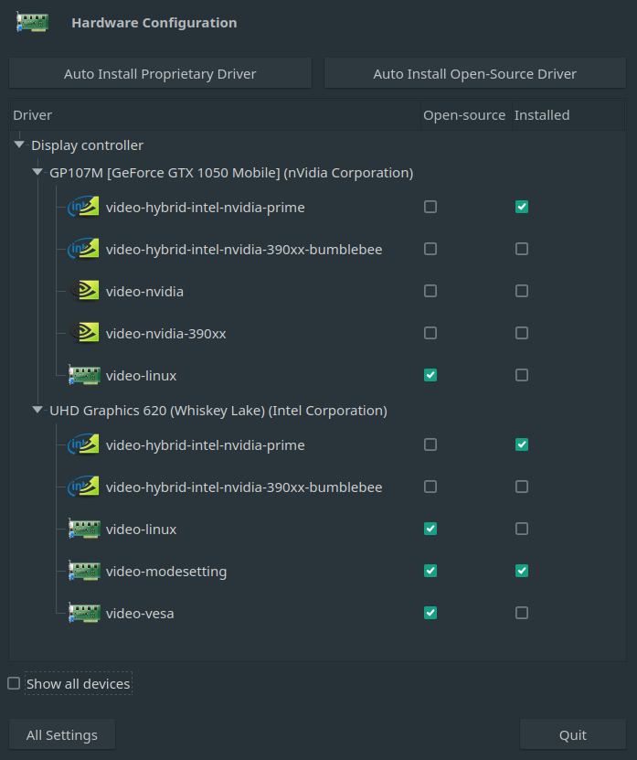

# Reason

[This doesn't need much explaining](https://www.youtube.com/watch?v=_36yNWw_07g) but here we go. \
Owning an [Optimus](https://wiki.archlinux.org/index.php/NVIDIA_Optimus) laptop is a pain if you need to actually utilize the GPU and get a painless, no visual artifacts experience on Linux.  \
This repository is for future me to have a starting point on a configuration that actually worked well at a point in time.

# Disclaimer
I'm not responsible if by the magic of google you end up here and make your system unusable. I can't say i fully udnerstand everything that is going on here and I recommend you do your own research first.

# My specs
## Hardware
[ASUS UX533FD laptop](https://www.asus.com/Laptops/For-Home/ZenBook/ZenBook-15-UX533/)
* CPU: Intel Core i7-8565U (UHD 630 graphics)
* GPU: Nvidia GTX 1050 [Max-Q](https://blogs.nvidia.com/blog/2018/12/14/what-is-max-q/)
## Software
* Manjaro Linux AwesomeWM Edition (installed through Manjaro Architect)
* AwesomeWM
* picom

# Issues with Optimus
* Open source Nvidia drivers are garbage.
* Closed source Nvidia drivers are also garbage
* Most solutions come with a performance or usability hit ([Bumblebee](https://wiki.archlinux.org/index.php/Bumblebee), [optimus-manager](https://github.com/Askannz/optimus-manager))
* Screen tearing

# Theoretical solution
The logical conclusion after reading the Nvidia related sections on the Arch Wiki was [PRIME render offload](https://wiki.archlinux.org/index.php/PRIME#PRIME_render_offload) using the Nvidia proprietary drivers. The problem with that is that when you're connecting external monitors they don't get detected. Also, getting rid of screen tearing requires a kernel parameter that keeps the Nvidia GPU always powered on, but more on that later.

# Actual solution
Using the Nvidia GPU at all times, sacrificing a bit of comfort (65+ degrees Celsius on the GPU) or a bit of performance and my own sanity (throttling the GPU by setting some more kernel parameters).

## Step 1 (possibly optional)
### DO NOT LET MANJARO ARCHITECT INSTALL THE RECOMMENDED NONFREE DRIVERS!
Instead, manually select video-nvidia. This will most probably fail (no clue why), but you get to a usable Desktop and you can continue installing the correct drivers (video-hybrid-intel-nvidia-prime) there, using your preffered method (mhwd or the Manjaro Driver GUI). Here's a screenshot for reference:



And the output of `mhwd -li`:
```bash
➜ mhwd -li
> Installed PCI configs:
-------------------------------------------------------------------------------
        NAME                        VERSION          FREEDRIVER        TYPE
-------------------------------------------------------------------------------
video-modesetting                   2020.01.13       true              PCI
video-hybrid-intel-nvidia-prime     2020.11.30       false             PCI


Warning: No installed USB configs!
```
## Step 2
Create a file called `10-nvidia-drm-outputclass.conf` in `/etc/X11/xorg.conf.d` with this content:
```bash
Section "OutputClass"
    Identifier "intel"
    MatchDriver "i915"
    Driver "modesetting"
EndSection

Section "OutputClass"
    Identifier "nvidia"
    MatchDriver "nvidia-drm"
    Driver "nvidia"
    Option "AllowEmptyInitialConfiguration"
    Option "PrimaryGPU" "yes"
    ModulePath "/usr/lib/nvidia/xorg"
    ModulePath "/usr/lib/xorg/modules"
EndSection
```
(or use the one in the repository).

## Step 3 - Activate modesetting
Create a file called `nvidia_modesetting.conf`(or whatever helps you keep track of what it contains) in `/etc/modprobe.d` with the line
```
options nvidia-drm modeset=1
```
(or use the one in this repository).

## Step 4 (?) - Remove some blacklisted kernel modules
It seems that in my current config, I didn't do this (maybe I forgot). Usually you need to delete these 2 lines:
```
blacklist drm_kms_helper
blacklist drm
```
from `/etc/modprobe.d/mhwd-gpu.conf`.\
Modesetting seems to work fine even if those are blacklisted:
```bash
➜ sudo cat /sys/module/nvidia_drm/parameters/modeset
Y
```

### Step 4.1 (optional) - Install picom and use a window manager
To actually get rid of screen tearing, a compositor that creates a 3D context that the Nvidia GPU can VSync to is needed. The one I know does this is [picom](https://github.com/yshui/picom). For that you will need to use a window manager (you can't change the compositor in normal Desktop Environments).

## Step 5 - Regenerate the initramfs
On Arch based systems run
```
➜ mkinitcpio -P
```

## Step 6
Follow the instructions [here](https://wiki.archlinux.org/index.php/NVIDIA_Optimus#Use_NVIDIA_graphics_only). \
In my case, the files I used are in this repository under `etc/lightdm`.
### Note
I think in the last few versions of the driver the name of the Nvidia provider changed from `NVIDIA-0` to `NVIDIA-G0`, making most tutorials on the internet useless (at the time of writing this).

## Step 7 (optional) - Throttle down the GPU
Add a new file under `/etc/modprobe.d` with something like this:
```
options nvidia NVreg_RegistryDwords="PowerMizerEnable=0x1;PerfLevelSrc=0x2233;PowerMizerDefault=0x3;PowerMizerDefaultAC=0x2"
```

### Explanation (can't remember where I found a complete explanation for these)
* PowerMizerEnable
  * 0x1 (enabled) 
  * 0x0 (disabled)
* PerfLevelSrc
  * 0x2222 (set performance level on both battery and AC)
  * 0x2233 (set performance level on battery, dynamic on AC)
  * 0x3322 (set performance level on AC, dynamic on battery)
  * 0x3333 (dynamic performance level on both battery and AC)
* PowerMizerDefault (default PowerMizer level on battery)
  * 0x3 (lowest, level 0 inside nvidia-settings PowerMizer)
  * 0x2 (dynamic, level 1 inside nvidia-settings PowerMizer)
  * 0x1 (performance, levels 2 and 3 inside nvidia-settings PowerMizer)
* PowerMizerDefaultAC (default PowerMizer level on AC)
  * 0x3 (lowest, level 0 inside nvidia-settings PowerMizer)
  * 0x2 (dynamic, level 1 inside nvidia-settings PowerMizer)
  * 0x1 (performance, levels 2 and 3 inside nvidia-settings PowerMizer)

For my config that would be: PowerMizer enabled, level 1 on AC and level 0 on battery

# Final notes
* Consider adding dotbot management for these files (they're not really dotfiles, but unless something breaks in future driver versions, it would be faster this way)